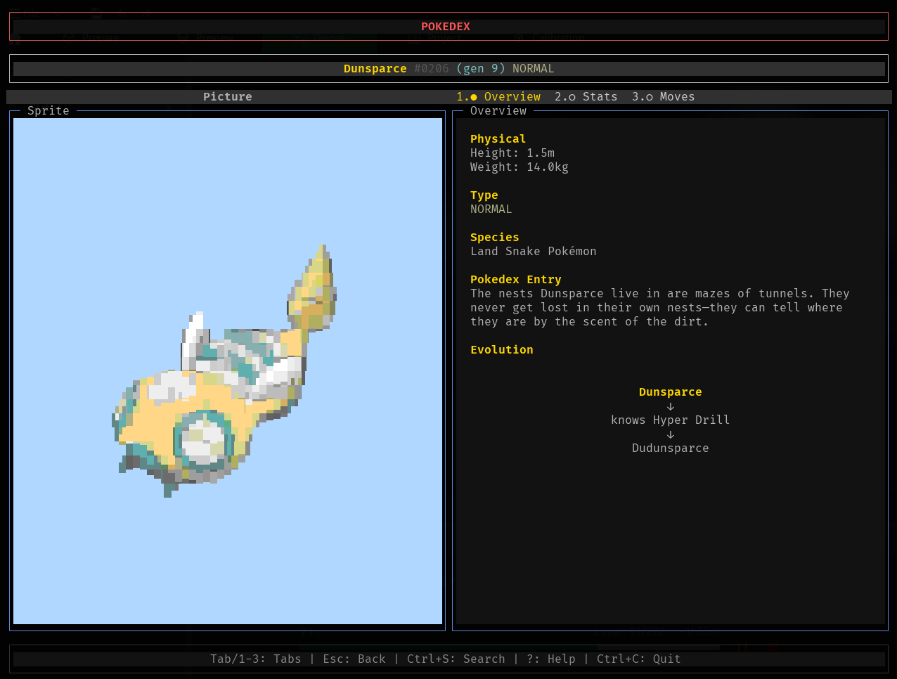

# Pokedex CLI

An interactive command-line Pokedex application built with TypeScript, featuring fuzzy search and ASCII art sprites.



## Quick Start (TL;DR)

```bash
# Install dependencies
sudo apt-get install chafa  # Ubuntu/Debian
brew install chafa          # macOS

# Install globally
npm install -g poclidex

# Run
poclidex
```

## Features

- 1000+ Pokemon from all generations
- Fuzzy search with autocomplete
- ASCII art sprites (Chafa, truecolor/16M colors)
- Stats display: base stats, EV yield, abilities, type colors
- Evolution chain navigation

## Prerequisites

- **Node.js** 18+ (for ESM support)
- **npm** or **yarn**
- **chafa** (for ASCII art sprite rendering)

### Installing Chafa

**Ubuntu/Debian:**

```bash
sudo apt-get install chafa
```

**macOS:**

```bash
brew install chafa
```

**Arch Linux:**

```bash
sudo pacman -S chafa
```

Works without Chafa but sprites won't display.

## Installation

```bash
# 1. Clone or navigate to the repository:
cd pokedex

# 2. Install dependencies:
npm install

# 3. Build the project:
npm run build

# 4. Run the application:
npm start

# Alternatively, build and run in one command:
npm run dev
```

## Usage

### Shell Completion (Optional)

**Bash:**

```bash
# bigger completion script, no delay on shell load
poclidex --completion bash >> ~/.bashrc

# or smaller completion script, small delay on shell load
echo -n 'eval "$(poclidex --completion bash)"' >> ~/.bashrc
```

**Zsh:**

```bash
# bigger completion script, no delay on shell load
poclidex --completion zsh >> ~/.zshrc

# or smaller completion script, small delay on shell load
echo -n 'eval "$(poclidex --completion zsh)"' >> ~/.zshrc
```

## Technology Stack

- **TypeScript** - Type-safe development
- **Blessed** - Terminal UI framework
- **pokedex-promise-v2** - Pokemon API wrapper
- **fuzzysort** - Fuzzy search and autocomplete
- **Chafa** - Image to ASCII conversion

## Development

### Scripts

- `npm run build` - Compile TypeScript to JavaScript
- `npm start` - Run the compiled application
- `npm run dev` - Build and run in one command
- `npm run watch` - Watch mode for development
- `npm run debug-colors` - Test and debug terminal color support

## Data Sources

All Pokemon data is fetched from the [PokeAPI v2](https://pokeapi.co/), a free and open Pokemon API.

## Troubleshooting

### Color Support Issues

**Sprites look washed out or limited to 256 colors:**

The app auto-detects your terminal's color capabilities. Truecolor (16M colors) is recommended.

**Check your terminal's color support:**

```bash
npm run debug-colors
```

Or run the standalone test:

```bash
./scripts/test-colors.sh
```

**Fix truecolor support:**

1. **Using tmux?** Add to `~/.tmux.conf`:

   ```bash
   set -g default-terminal "${TERM}"
   set -a terminal-features 'xterm-256color:RGB'
   ```

   Then reload: `tmux source-file ~/.tmux.conf`

2. **Terminal emulators:**
   - **macOS**: iTerm2, Kitty, Alacritty, WezTerm
   - **Linux**: Kitty, Alacritty, GNOME Terminal 3.x+, Konsole
   - **Windows**: Windows Terminal, WezTerm

3. **Set environment variable:**

   ```bash
   export COLORTERM=truecolor
   ```

4. **Force color mode:**

   ```bash
   # Force truecolor
   export POKEDEX_COLORS=full
   npm start

   # Or force 256 colors
   export POKEDEX_COLORS=256
   npm start
   ```

**Debug Chafa commands:**

```bash
DEBUG_COLORS=1 npm start
```

### Sprites not displaying

- Ensure Chafa is installed: `chafa --version`
- Check that sprites are downloading (requires internet connection)

### Application crashes on search

- Wait for Pokemon data to finish loading
- Ensure you have a stable internet connection for API calls

### Display issues

- Try resizing your terminal window (minimum 80x24 recommended)
- Use a modern terminal emulator with Unicode support
- If using SSH, ensure `COLORTERM` is forwarded or set on the remote machine

## Contributing

Possible additions:

- type effectiveness calculator
- shiny sprite toggle

## License

[Zero-Clause BSD](https://opensource.org/license/0bsd)

## Acknowledgments

- [PokeAPI](https://pokeapi.co/) for the comprehensive Pokemon database
- [Blessed](https://github.com/chjj/blessed) for the terminal UI framework
- [Chafa](https://hpjansson.org/chafa/) for ASCII art rendering
- Pokémon is © Nintendo/Creatures Inc./GAME FREAK inc.
